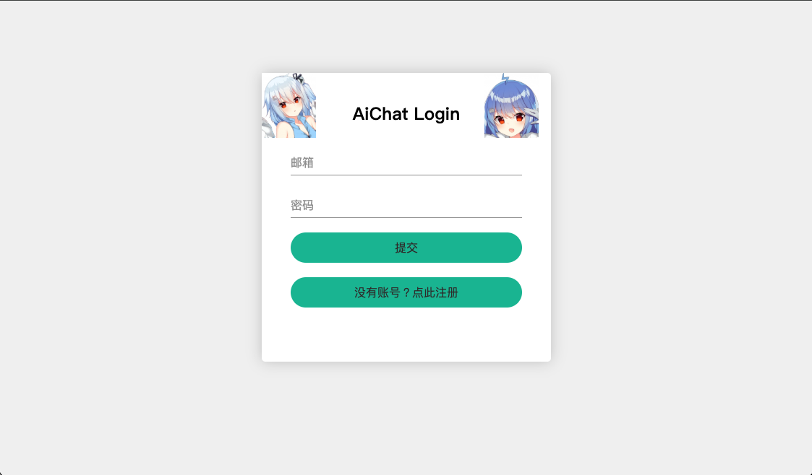
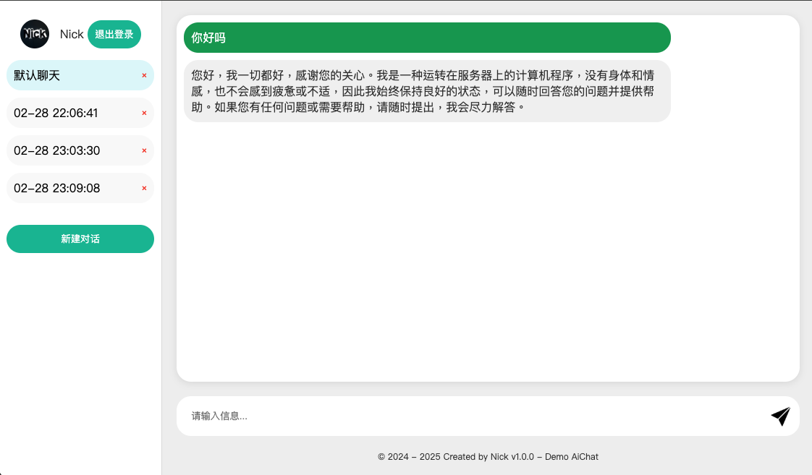

# AiChat 项目说明

## 项目介绍

AiChat 是一个基于 Vue3 和 Express 的聊天应用项目，包含前后端分离的架构设计。

### 在线体验

- 项目演示地址：[https://lcngr.zrllove.cn/](https://lcngr.zrllove.cn/)
- 作者个人网站：[https://www.zrllove.cn/](https://www.zrllove.cn/)

### 界面预览

#### 登录界面



#### 聊天界面



## 环境要求

- Node.js (建议 v14 或更高版本)
- MySQL(推荐 8.0+；若为 5.7+请自行修改代码，将导入包换为 mysql)
- Redis

## 项目配置

### 1. 数据库配置

在 `AiChat_back/utils/db.js` 文件中配置 MySQL 数据库连接信息：

```javascript
const mysql = require("mysql2");

// 创建数据库连接
const connection = mysql.createConnection({
  host: "localhost", // 数据库地址
  user: "your_username", // 数据库用户名
  password: "your_password", // 数据库密码
  database: "aichat", // 数据库名称
});
```

### 2. 邮箱验证码配置

在 `AiChat_back/utils/sendVerificationCode.js` 文件中配置邮箱服务：

```javascript
const transporter = nodemailer.createTransport({
  host: "smtp.example.com", // 替换为你的SMTP服务器地址
  port: 465, // SMTP端口，通常是465（SSL）或587（TLS）
  secure: true, // 使用SSL
  auth: {
    user: "your@email.com", // 发件人邮箱地址
    pass: "your_password", // 邮箱授权码或密码
  },
});

// 修改邮件发送人信息
const mailOptions = {
  from: '"AiChat" <your@email.com>', // 修改为你的邮箱地址
  // ...
};
```

## 项目运行步骤

### 1. 数据库准备

1. 创建 MySQL 数据库
2. 导入项目根目录下的 `Demo_AiChat.sql` 文件

### 2. 后端配置

1. 进入后端目录：

```bash
cd AiChat_back
```

2. 安装依赖：

```bash
npm install
```

3. 启动后端服务：

```bash
node app.js
```

### 3. 前端配置

1. 进入前端目录：

```bash
cd AiChat_front
```

2. 安装依赖：

```bash
npm install
```

3. 开发模式运行：

```bash
npm run dev
```

## 常见问题

### 1. 邮箱验证码发送失败

- 检查 SMTP 服务器配置是否正确
- 确认邮箱授权码是否有效
- 检查邮箱服务器是否开启 SMTP 服务

### 2. 数据库连接失败

- 确认 MySQL 服务是否正常运行
- 检查数据库用户名和密码是否正确
- 确认数据库名称是否正确

### 3. Redis 连接问题

- 确保 Redis 服务已启动
- 检查 Redis 连接配置是否正确

## 注意事项

1. 确保所有配置文件中的敏感信息（如密码、密钥等）在部署时已正确设置
2. 建议在开发环境中使用环境变量管理敏感配置信息
3. 首次运行前确保已完成所有必要的配置步骤

## 技术栈

- 前端：Vue 3 + Vite + Ant Design Vue
- 后端：Express + MySQL + Redis + Nodemailer

## 许可证

MIT License
